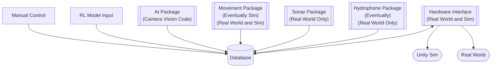

# 0007-AUV_Code
This is a not actually forked version of the KSU AUV 2024-2025 Software that I am working with.

'-' in a filename means not complete yet. working on it. 

## The way we want this to work.

## The below flowchart represents how we want the program setup during full operation

---

## 